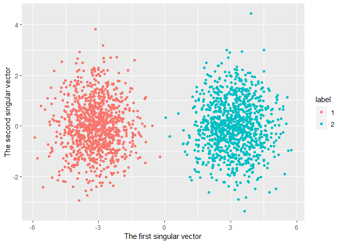
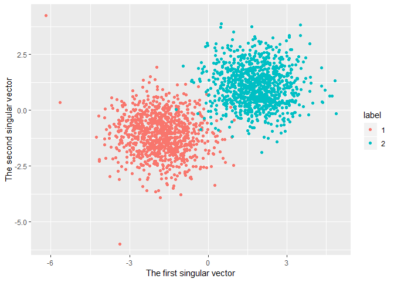

<!-- README.md is generated from README.Rmd. Please edit that file -->
frequentdirections [](https://travis-ci.com/shinichi-takayanagi/frequentdirections)
==================================================================================================================================================================================

Implementation of Frequent-Directions algorithm for efficient matrix sketching \[E. Liberty, SIGKDD2013\]

Installation
------------

``` r
# Not yet onCRAN
install.packages("frequentdirections")

# Or the development version from GitHub:
install.packages("devtools")
devtools::install_github("shinichi-takayanagi/frequentdirections")
```

Example
-------

``` r
# (Meaningless) dummy data
size_col <- 50
size_row <- 10^3
x <- matrix(
  c(rnorm(size_row * size_col), rnorm(size_row * size_col, mean=1)),
  ncol = size_col, byrow = TRUE
)
x <- scale(x)
y <- rep(1:2, each=size_row)
# Show 2D plot using SVD
frequentdirections::plot_svd(x, y)
```



``` r
# Matrix Skethinc(l=6)
b <- frequentdirections::sketching(x, 6, 10^(-8))
# Show 2D plot using sketched matrix and show similar result with the above
# That means that 6 dim is enough to express the original data matrix (x)
frequentdirections::plot_svd(x, y, b)
```



For more details using real world data, See [vignette](https://cran.r-project.org/web/packages/frequentdirections/vignettes/introduction.html).
