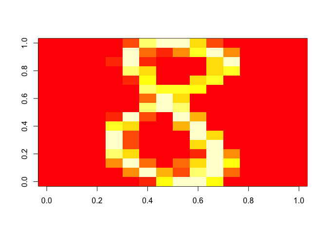
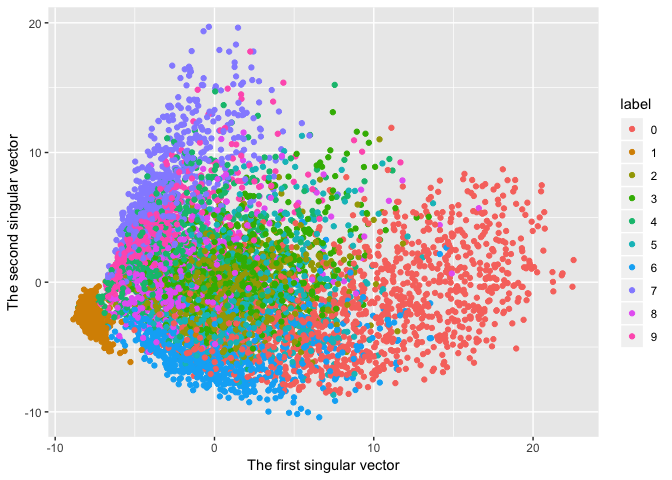
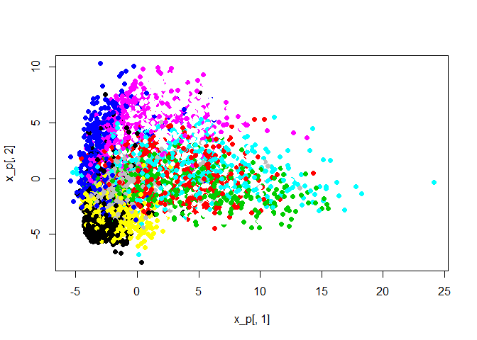
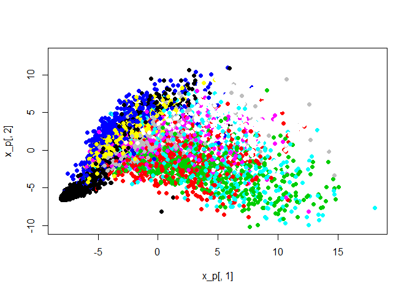
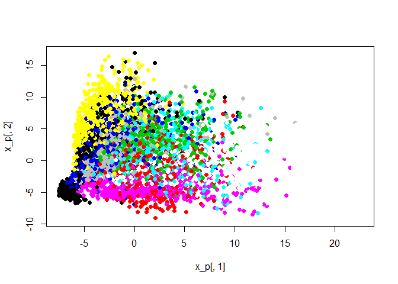

<!-- README.md is generated from README.Rmd. Please edit that file -->
frequentdirections [](https://travis-ci.com/shinichi-takayanagi/frequentdirections)
==================================================================================================================================================================================

Implementation of Frequent-Directions algorithm for efficient matrix sketching \[E. Liberty, SIGKDD2013\]

Installation
------------

``` r
# Not yet from CRAN
# install.packages("frequentdirections")

# Or the development version from GitHub:
# install.packages("devtools")
devtools::install_github("shinichi-takayanagi/frequentdirections")
```

Example
-------

### Download example data

Here, we use [Handwritten digits USPS dataset](https://www.kaggle.com/bistaumanga/usps-dataset/version/1) as sample data. In the following example, we assume that you save the above sample data into `temp` directory.

### Load data

The dataset has 7291 train and 2007 test images in `h5` format. The images are 16\*16 grayscale pixels.

``` r
library("h5")
file <- h5file("C:\\temp\\usps.h5")
x <- file["train/data"][]
y <- file["train/target"][]
str(x)
#>  num [1:7291, 1:256] 0 0 0 0 0 0 0 0 0 0 ...
```

### Plot example image

Example 8

``` r
image(matrix(x[338,], nrow=16, byrow = FALSE))
```



### Plot SVD

``` r
x <- scale(x)
frequentdirections::plot_svd(x, y)
```



### Matrix Sketching

#### l = 8 case

``` r
eps <- 10^(-8)
# 7291 x 256 -> 8 * 256 matrix
b <- frequentdirections::sketching(x, 8, eps)
frequentdirections::plot_svd(x, y, b)
```



#### l = 32 case

``` r
# 7291 x 256 -> 32 * 256 matrix
b <- frequentdirections::sketching(x, 32, eps)
frequentdirections::plot_svd(x, y, b)
```



#### l = 128 case

``` r
# 7291 x 256 -> 128 * 256 matrix
b <- frequentdirections::sketching(x, 128, eps)
frequentdirections::plot_svd(x, y, b)
```


